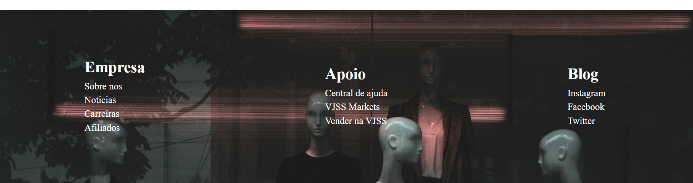

# PROJETO 💻

## linguagens usadas 🪛
- HTML
- CSS
- JAVASCRIPT

## conhecimento adquirido 🧠
fiz o uso do projeto que ja postei no meu github de Rolagem-image usando o Javascript e o uso do hover juntamente com Pseudo-elemento ::after e ::before.
